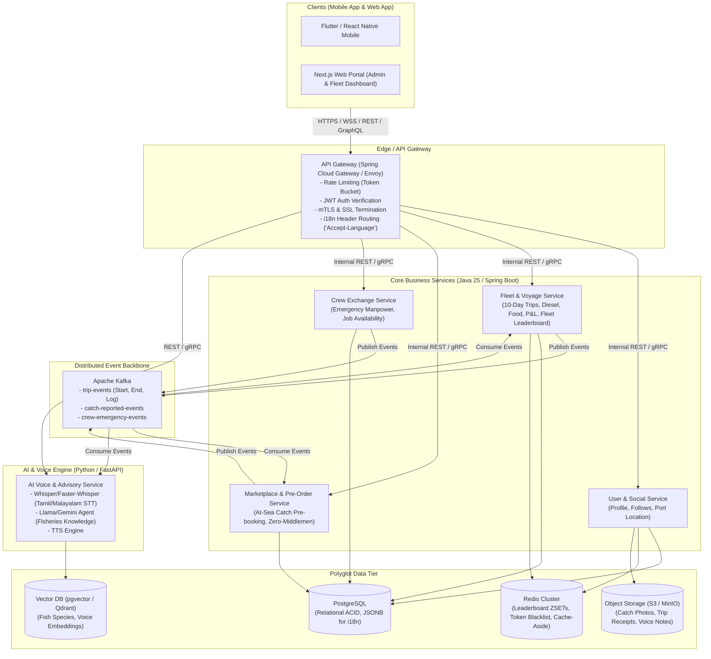
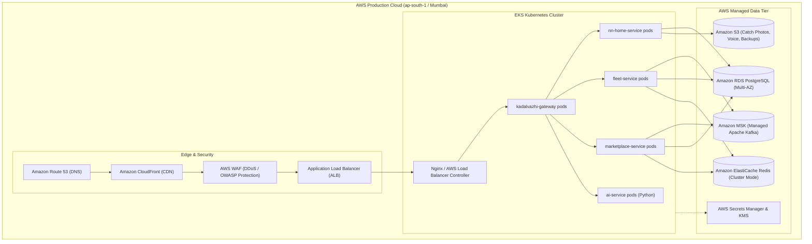
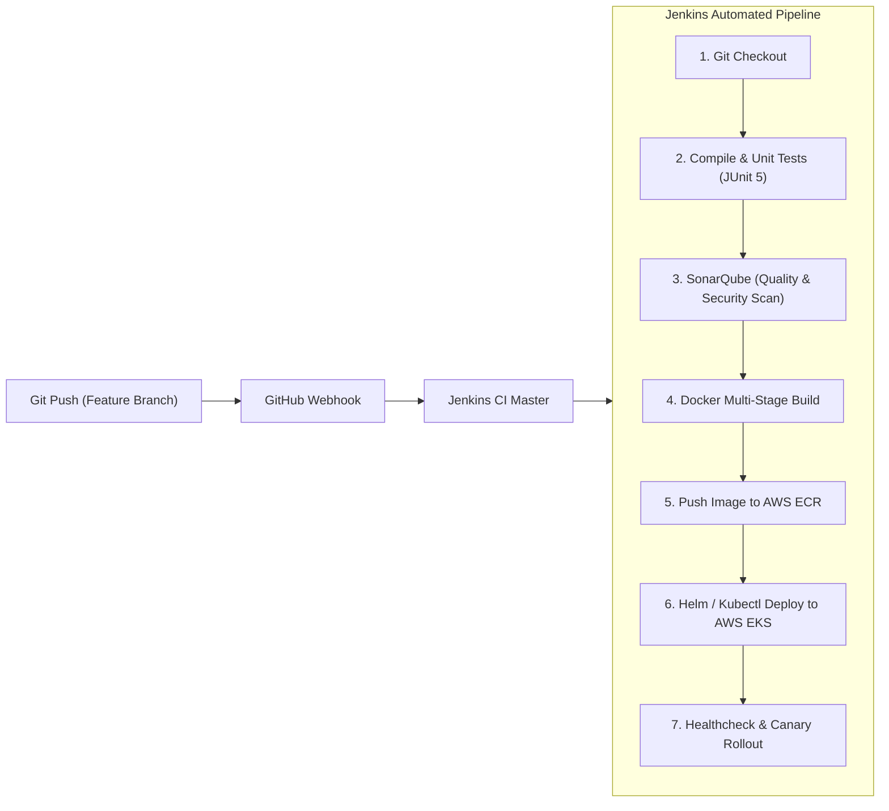

# Kadal Vazhi (கடல் வழி) — Microservices Architecture & V1 Blueprint

An enterprise-grade, low-latency, polyglot microservices platform tailored for deep-sea fishing communities, fleet owners, crew exchange, and direct-to-consumer maritime commerce.

---

## 1. System Architecture Overview

---

### 2. Vessel Classification: All Boat Types Supported

Kadal Vazhi serves the entire spectrum of maritime vessels, not just large trawlers:

| Vessel Category | Tamil Common Name | Trip Duration | Crew Size | Engine / Fuel Type | Unique Needs |
| :--- | :--- | :--- | :--- | :--- | :--- |
| **Traditional / Country Craft** | நாட்டுப் படகு / கட்டுமரம் | 4 – 12 hours | 1 – 3 | Manual oars or small OBM (Kerosene/Petrol) | Quick daily catch, immediate shore landing. |
| **Motorized Fiber Boat (FRP)** | ஃபைபர் படகு | 1 day (Early morning to evening) | 2 – 5 | Outboard Motor (OBM) — Petrol/Kerosene | Daily fuel tracking, ice box catch preservation. |
| **Mechanized Gillnetter / Trawler** | விசைப்படகு (ட்வாலிங்) | 3 – 15 days | 8 – 15 | Inboard Diesel Engine (Heavy Diesel) | Bulk diesel, ration supplies, cold storage, multi-tier crew roster. |
| **Deep-Sea Longliner / Tuna Craft** | ஆழ்கடல் தூண்டில் படகு | 15 – 30 days | 10 – 18 | Heavy Diesel + Generator | Tuna export grade tracking, blast freezing, satellite communication. |

---

## 3. Critical Real-World Maritime Needs You Must Not Miss

1. **Offline-First Data Sync (Zero Network at Deep Sea)**:
   - *The Reality*: 5 to 10 nautical miles shore-la irundhu thalli pona **mobile signal ZERO**.
   - *Architecture*: Mobile app-la local SQLite / Room DB. Captain sea-la daily diesel, catch, food expenses record pannuvanga. Boat shore-ku varum podhu 4G signal kedaicha odane backend-kku **Idempotent Background Sync** aagum.
2. **Fuel Quota & Subsidized Fuel Tracking**:
   - Indian coastal states (Tamil Nadu, Kerala) grant subsidized diesel & kerosene for registered fishermen.
   - Kadal Vazhi should track monthly government quota balance.
3. **Harbor & Fish Landing Center (FLC) Registry**:
   - Catch pre-order valid aaga irukanumna, customer-kku boat entha harbor-la (e.g. Kasimedu, Tuticorin, Rameswaram, Munambam) ethana manikku (ETA) land aagum nu accurate-ah theriya vendum.
4. **Weather, Cyclone & Marine Safety Alerts (IMD / INCOIS Integration)**:
   - High wave alerts, cyclone warnings, ocean current data, and Potential Fishing Zones (PFZ).
   - Instant SMS / Push notification when coast guard flags bad weather.
5. **Government Annual Fishing Ban Period (மீன்பிடி தடைக்காலம்)**:
   - 61-day annual ban compliance check (East Coast: April 15 - June 14; West Coast: June 1 - July 31).

---

## 4. Recommended Microservices & Repository Plan

| Repository Name | Tech Stack | Primary Responsibility |
| :--- | :--- | :--- |
| **`nn-home-service`** *(Current)* | Java 25, Spring Boot | **Home Aggregator & User Social Service**: User profiles, roles, boat follow relations, home feed aggregator. |
| **`kadalvazhi-fleet-service`** | Java 25, Spring Boot | **Vessel & Voyage Engine**: 1-day & 15-day trip lifecycle, fuel ledger (Diesel/Petrol/Kerosene), ice & supplies, crew roster, P&L analytics, Redis leaderboards. |
| **`kadalvazhi-crew-exchange-service`** | Java 25, Spring Boot | **Emergency Crew Exchange**: Quick hiring board ("3 crew urgently needed at Port X"), real-time worker availability. |
| **`kadalvazhi-marketplace-service`** | Java 25, Spring Boot | **Direct Catch Pre-order**: At-sea catch declaration, dockside pre-booking, eliminating exploitative middlemen. |
| **`kadalvazhi-gateway`** | Spring Cloud Gateway | Auth JWT verification, rate limiting, SSL, routing. |
| **`kadalvazhi-ai-service`** | Python 3.12, FastAPI | AI Voice assistant (Tamil/Malayalam STT/TTS), seasonal fish advisory, smart crew matching. |
| **`kadalvazhi-weather-service`** | Java or Python | INCOIS/IMD weather scraping, ocean alerts, harbor advisories. |
| **`kadalvazhi-common-lib`** | Java (Shared library) | Shared DTOs, Kafka event contracts, security filters, error handlers. |
| **`kadalvazhi-frontend`** | Flutter (Mobile) + Next.js (Web) | Offline-enabled mobile app + fleet management web dashboard. |

---

## 5. AWS Cloud Architecture & Infrastructure

---

## 6. Jenkins CI/CD Pipeline Flow

---

## 7. Communication Protocols & i18n Strategy

1. **REST (OpenAPI 3.0)**: Mobile/Web $\to$ Gateway $\to$ Microservices for standard CRUD.
2. **GraphQL**: Fleet Analytics Dashboard for complex aggregated queries (12 boats + fuel + P&L in one roundtrip).
3. **gRPC (HTTP/2 Protobuf)**: Low-latency synchronous service-to-service communication.
4. **Apache Kafka (Amazon MSK)**: Asynchronous event streaming (`TripEndedEvent`, `CatchDeclaredEvent`, `UrgentCrewNeededEvent`).
5. **i18n**: 
   - Static UI strings: Client local JSON files (`en.json`, `ta.json`, `ml.json`) $\to$ zero network latency.
   - Master data (Fish, ports): PostgreSQL `JSONB` with GIN indexing.
   - Dynamic user posts: Native language storage with on-demand AI translation.

---

## 8. Version Scope Boundary

### Version 1 (V1)
- Auth (Phone OTP + JWT) & Role-Based Access (Fisherman, Captain, Fleet Owner, Crew, Buyer, Admin).
- User Profiles, Follow system, and Home Feed Aggregator (`nn-home-service`).
- All-Boat Voyage & Fuel Expense Tracker (1-day country/fiber boat to 15-day trawler; Diesel/Petrol/Kerosene).
- Fleet Dashboard & P&L Analysis (Profit vs Loss comparison across 12+ boats).
- Emergency Crew Replacement Board (urgent hiring for missing deckhands/drivers).
- Direct-From-Sea Pre-Order Marketplace (Harbor arrival ETA + catch booking).
- Multi-Language (English, Tamil, Malayalam).
- Dockerized microservices on AWS EKS with Jenkins CI/CD automation.

### Version 2 (V2)
- Fishing Reels & Video Streaming Pipeline (HLS/DASH + CloudFront).
- Real-Time Duplex Voice AI Agent via WebRTC.
- Automated Live Harbor Auction with WebSocket bidding.
- Satellite / IoT GPS Vessel Transponder Integration.
